---
## Front matter
title: "Лабораторная работа №2"
subtitle: "Архитектура вычислительных систем"
author: "Валиева Марина Русланбековна"

## Generic otions
lang: ru-RU
toc-title: "Содержание"

## Bibliography
bibliography: bib/cite.bib
csl: pandoc/csl/gost-r-7-0-5-2008-numeric.csl

## Pdf output format
toc: true # Table of contents
toc-depth: 2
lof: true # List of figures
lot: true # List of tables
fontsize: 12pt
linestretch: 1.5
papersize: a4
documentclass: scrreprt
## I18n polyglossia
polyglossia-lang:
  name: russian
  options:
	- spelling=modern
	- babelshorthands=true
polyglossia-otherlangs:
  name: english
## I18n babel
babel-lang: russian
babel-otherlangs: english
## Fonts
mainfont: PT Serif
romanfont: PT Serif
sansfont: PT Sans
monofont: PT Mono
mainfontoptions: Ligatures=TeX
romanfontoptions: Ligatures=TeX
sansfontoptions: Ligatures=TeX,Scale=MatchLowercase
monofontoptions: Scale=MatchLowercase,Scale=0.9
## Biblatex
biblatex: true
biblio-style: "gost-numeric"
biblatexoptions:
  - parentracker=true
  - backend=biber
  - hyperref=auto
  - language=auto
  - autolang=other*
  - citestyle=gost-numeric
## Pandoc-crossref LaTeX customization
figureTitle: "Рис."
tableTitle: "Таблица"
listingTitle: "Листинг"
lofTitle: "Список иллюстраций"
lotTitle: "Список таблиц"
lolTitle: "Листинги"
## Misc options
indent: true
header-includes:
  - \usepackage{indentfirst}
  - \usepackage{float} # keep figures where there are in the text
  - \floatplacement{figure}{H} # keep figures where there are in the text
---

# Цель работы

Целью работы является изучить идеологию и применение средств контроля
версий. Приобрести практические навыки по работе с системой git

# Задание

Здесь приводится описание задания в соответствии с рекомендациями
методического пособия и выданным вариантом.

# Выполнение лабораторной работы

2.4.1. Настройка github
Для выполнения лабораторных работ мы создали учетную запись на сайте https://github.com/ и заполнили основные данные.
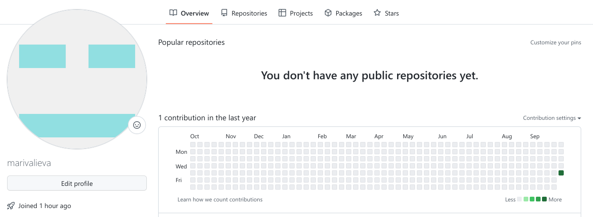{ #fig:001 width=90% }

2.4.2 Базовая настройка git.
Сначала сделаем предварительную конфигурацию git. Откроем терминал и введем следующие команды, указав имя и email владельца репозитория:
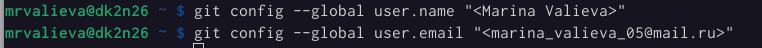{ #fig:002 width=90% }
Настроим utf-8 в выводе сообщений git
{ #fig:003 width=90% }
Зададим имя начальной ветки (будем называть её master):
{ #fig:004 width=90% }
Параметр autocrlf:
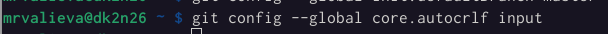{ #fig:005 width=90% }
Параметр safecrlf:
{ #fig:006 width=90% }

2.4.3. Создание SSH ключа
Для последующей идентификации пользователя на сервере репозиториев необходимо сгенерировать пару ключей (приватный и открытый):
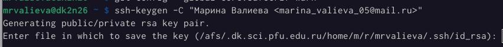{ #fig:007 width=90% }
Далее необходимо загрузить сгенерённый открытый ключ. Для этого зайдем на сайт http://github.org/ под своей учётной записью и перейдем в меню Setting . После этого выберем в боковом меню SSH and GPG keys и нажмем кнопку New SSH key .
Скопировав из локальной консоли ключ в буфер обмена
{ #fig:008 width=90% }
вставляем ключ в появившееся на сайте поле и указываем для ключа имя
(Title).
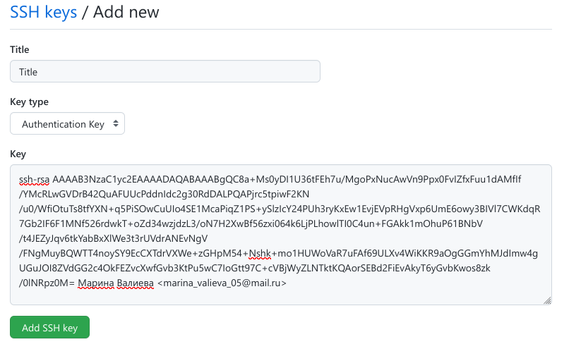{ #fig:009 width=90% }
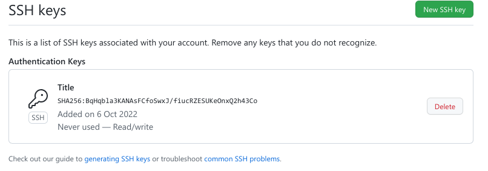{ #fig:010 width=90% }

2.4.4. Сознание рабочего пространства и репозитория курса на основе шаблона
Откроем терминал и создадим каталог для предмета «Архитектура компьютера»:
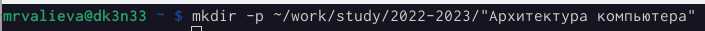{ #fig:011 width=90% }

2.4.5. Сознание репозитория курса на основе шаблона
Перейдем на станицу репозитория с шаблоном курса https://github.com/yamadharma/course-directory-student-template.
Далее выберем Use this template.
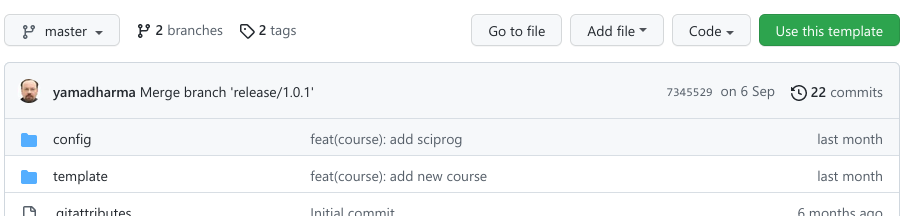{ #fig:012 width=90% }
В открывшемся окне зададим имя репозитория (Repository name) study_2022–2023_arh-pc и создадим репозиторий (кнопка Create repository from template).
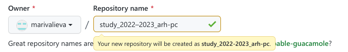{ #fig:013 width=90% }
Откроем терминал и перейдем в каталог курса:
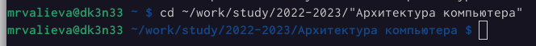{ #fig:014 width=90% }
Копируем ссылку для клонирования созданного репозитория.
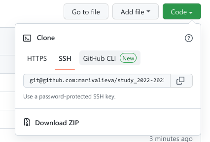{ #fig:015 width=90% }
клонируем созданный репозиторий
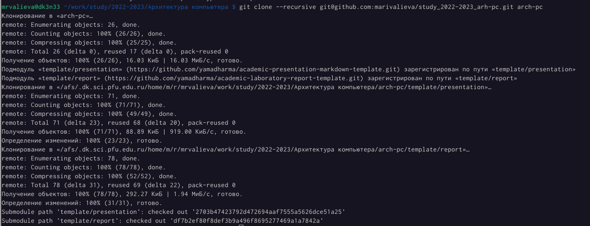{ #fig:016 width=90% }

2.4.6. Настройка каталога курса
Перейдем в каталог курса
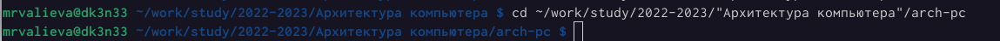{ #fig:017 width=90% }
Удалим лишние файлы
{ #fig:018 width=90% }
Создадим необходимые каталоги
{ #fig:019 width=90% }
Отправим файлы на сервер
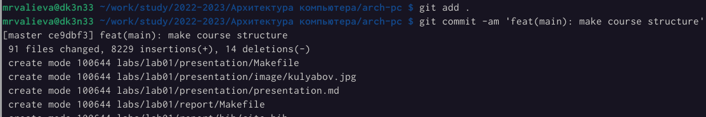{ #fig:020 width=90% }
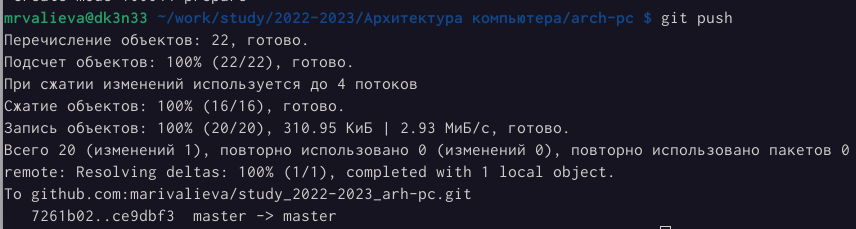{ #fig:021 width=90% }
Проверим правильность создания иерархии рабочего пространства в локальном репозитории и на странице github.
{ #fig:021 width=90% }
{ #fig:020 width=90% }

2.5. Задание для самостоятельной работы
1. Создадим отчет по выполнению лабораторной работы в соответствующем каталоге рабочего пространства (labs>lab03>report)
2. Скопируем отчеты по выполнению предыдущих лабораторных работ в соответствующие каталоги созданного рабочего пространства.
3. Загрузим файлы на github.

С помощью команды git add добавили файл Л01_Валиева_отчет.pfd в  labs>lab01>report.  А с помощью git commit зафиксировали состояние. С помощью git push загрузили на github.
{ #fig:021 width=90% }
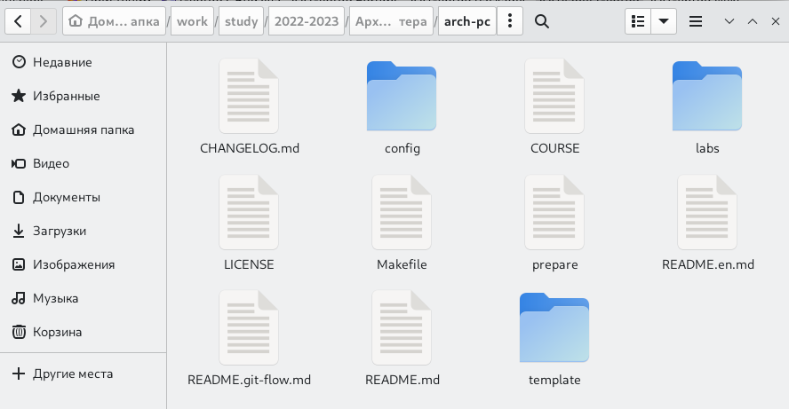{ #fig:022 width=90% }
Таким же образом загрузим 2 лабораторную работу в соответствующий каталог рабочего пространства и на github.

https://github.com/marivalieva/study_2022-2023_arh-pc
# Выводы

В ходе 2 лабораторной работы я изучила идеологии и применение средств контроля версий. Приобрела практических навыков по работе с системой git.

