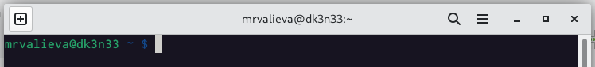
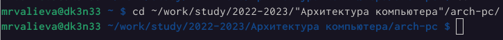
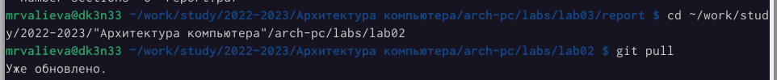
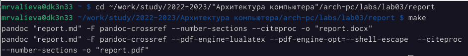
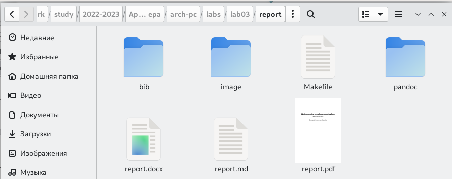
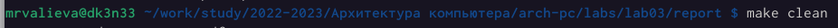
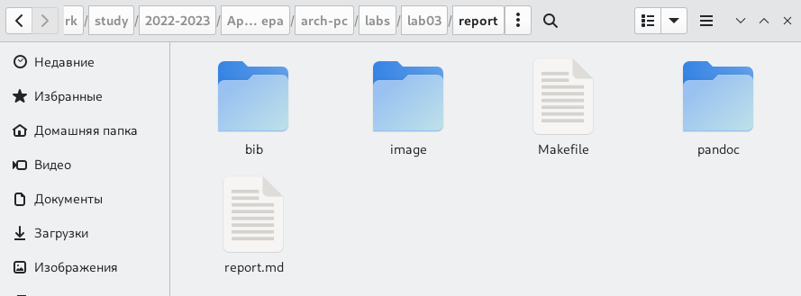
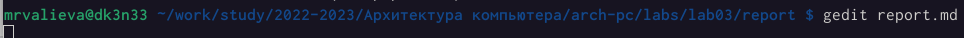
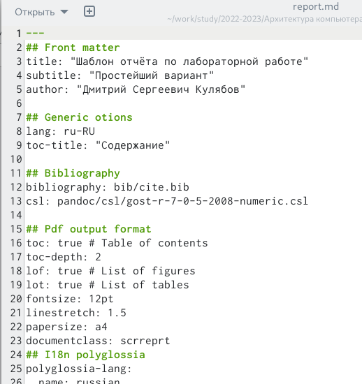

---
## Front matter
title: "Лабораторная работа №3"
subtitle: "Архитектура вычислительных систем"
author: "Валиева Марина Русланбековна"

## Generic otions
lang: ru-RU
toc-title: "Содержание"

## Bibliography
bibliography: bib/cite.bib
csl: pandoc/csl/gost-r-7-0-5-2008-numeric.csl

## Pdf output format
toc: true # Table of contents
toc-depth: 2
lof: true # List of figures
lot: true # List of tables
fontsize: 12pt
linestretch: 1.5
papersize: a4
documentclass: scrreprt
## I18n polyglossia
polyglossia-lang:
  name: russian
  options:
	- spelling=modern
	- babelshorthands=true
polyglossia-otherlangs:
  name: english
## I18n babel
babel-lang: russian
babel-otherlangs: english
## Fonts
mainfont: PT Serif
romanfont: PT Serif
sansfont: PT Sans
monofont: PT Mono
mainfontoptions: Ligatures=TeX
romanfontoptions: Ligatures=TeX
sansfontoptions: Ligatures=TeX,Scale=MatchLowercase
monofontoptions: Scale=MatchLowercase,Scale=0.9
## Biblatex
biblatex: true
biblio-style: "gost-numeric"
biblatexoptions:
  - parentracker=true
  - backend=biber
  - hyperref=auto
  - language=auto
  - autolang=other*
  - citestyle=gost-numeric
## Pandoc-crossref LaTeX customization
figureTitle: "Рис."
tableTitle: "Таблица"
listingTitle: "Листинг"
lofTitle: "Список иллюстраций"
lotTitle: "Список таблиц"
lolTitle: "Листинги"
## Misc options
indent: true
header-includes:
  - \usepackage{indentfirst}
  - \usepackage{float} # keep figures where there are in the text
  - \floatplacement{figure}{H} # keep figures where there are in the text
---

# Цель работы

Целью работы является освоение процедуры оформления отчетов с помощью
легковесного языка разметки Markdown.

# Задание

Здесь приводится описание задания в соответствии с рекомендациями
методического пособия и выданным вариантом.

# Теоретическое введение

Здесь описываются теоретические аспекты, связанные с выполнением работы.

3.2.1. Базовые сведения о Markdown

Чтобы создать заголовок, используйте знак #, например:

# This is heading 1

## This is heading 2

### This is heading 3

#### This is heading 4

Чтобы задать для текста полужирное начертание, заключите его в двойные звездочки:

This text is **bold**.

Чтобы задать для текста курсивное начертание, заключите его в одинарные
звездочки:

This text is *italic*.


Архитектура ЭВМ

Чтобы задать для текста полужирное и курсивное начертание, заключите его
в тройные звездочки:

This is text is both ***bold and italic***.

Блоки цитирования создаются с помощью символа >:

> The drought had lasted now for ten million years, and the reign of
the terrible lizards had long since ended. Here on the Equator,
in the continent which would one day be known as Africa, the
battle for existence had reached a new climax of ferocity, and
the victor was not yet in sight. In this barren and desiccated
land, only the small or the swift or the fierce could flourish,
or even hope to survive.

↪
↪
↪
↪
↪
↪
Упорядоченный список можно отформатировать с помощью соответствую-
щих цифр:

1. First instruction

1. Sub-instruction

1. Sub-instruction

1. Second instruction

Чтобы вложить один список в другой, добавьте отступ для элементов дочер-
него списка:

1. First instruction

1. Second instruction

1. Third instruction

Неупорядоченный (маркированный) список можно отформатировать с помо-
щью звездочек или тире:

* List item 1

* List item 2

* List item 3


Архитектура ЭВМ

Чтобы вложить один список в другой, добавьте отступ для элементов дочер-
него списка:

- List item 1

- List item A

- List item B

- List item 2

Синтаксис Markdown для встроенной ссылки состоит из части [link text],
представляющей текст гиперссылки, и части (file-name.md) – URL-адреса или
имени файла, на который дается ссылка:

[link text](file-name.md)

или

[link text](http://example.com/ "Необязательная подсказка")

Markdown поддерживает как встраивание фрагментов кода в предложение, так и их размещение между предложениями в виде отдельных огражденных  блоков. Огражденные блоки кода — это простой способ выделить синтаксис для фрагментов кода. Общий формат огражденных блоков кода:

``` language

your code goes in here

```

# Выполнение лабораторной работы

Описываются проведённые действия, в качестве иллюстрации даётся ссылка на иллюстрацию (рис. [-@fig:001])

1. Откроем терминал.

{ #fig:001 width=95% }

2. Перейдем в каталог курса сформированный при выполнении лабораторной работы №2:
Обновим локальный репозиторий, скачав изменения из удаленного репозитория с 
помощью команды

{ #fig:002 width=95% }

{ #fig:003 width=95% }

3. Перейдем в каталог с шаблоном отчета по лабораторной работе № 3

4. Проведем компиляцию шаблона с использованием Makefile. Для этого введите команду.

{ #fig:004 width=95% }

При успешной компиляции должны сгенерироваться файлы report.pdf и report.docx. Откроем и проверим корректность полученных файлов.

{ #fig:005 width=95% }

5. Удалим полученный файлы с использованием Makefile. Для этого введем команду

{ #fig:006 width=95% }
Проверим, что после этой команды файлы report.pdf и report.docx были удалены.

{ #fig:007 width=95% }

6. Откроем файл report.md c помощью любого текстового редактора, например gedit

{ #fig:008 width=95% }

{ #fig:009 width=95% }

Внимательно изучим структуру этого файла.

7. Заполним отчет и скомпилируем отчет с использованием Makefile. Проверим корректность полученных файлов. (Обратим внимание, для корректного отображения скриншотов они должны быть размещены в каталоге image)

8. Загрузим файлы на github.

# Выводы

Я освоила процедуры оформления отчетов с помощью легковесного языка разметки Markdown.

# Список литературы{.unnumbered}

::: {#refs}
:::
