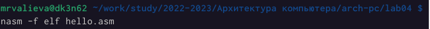

---
## Front matter
title: Отчет по лабораторной работе №4.
subtitle: "Создание и процесс обработки программ на языке ассемблера NASM"
author: "Валиева Марина Русланбековна"

## Generic otions
lang: ru-RU
toc-title: "Содержание"

## Bibliography
bibliography: bib/cite.bib
csl: pandoc/csl/gost-r-7-0-5-2008-numeric.csl

## Pdf output format
toc: true # Table of contents
toc-depth: 2
lof: true # List of figures
fontsize: 12pt
linestretch: 1.5
papersize: a4
documentclass: scrreprt
## I18n polyglossia
polyglossia-lang:
  name: russian
  options:
	- spelling=modern
	- babelshorthands=true
polyglossia-otherlangs:
  name: english
## I18n babel
babel-lang: russian
babel-otherlangs: english
## Fonts
mainfont: PT Serif
romanfont: PT Serif
sansfont: PT Sans
monofont: PT Mono
mainfontoptions: Ligatures=TeX
romanfontoptions: Ligatures=TeX
sansfontoptions: Ligatures=TeX,Scale=MatchLowercase
monofontoptions: Scale=MatchLowercase,Scale=0.9
## Biblatex
biblatex: true
biblio-style: "gost-numeric"
biblatexoptions:
  - parentracker=true
  - backend=biber
  - hyperref=auto
  - language=auto
  - autolang=other*
  - citestyle=gost-numeric
## Pandoc-crossref LaTeX customization
figureTitle: "Рис."
tableTitle: "Таблица"
listingTitle: "Листинг"
lofTitle: "Список иллюстраций"
lolTitle: "Листинги"
## Misc options
indent: true
header-includes:
  - \usepackage{indentfirst}
  - \usepackage{float} # keep figures where there are in the text
  - \floatplacement{figure}{H} # keep figures where there are in the text
---

# Цель работы

Освоение процедуры компиляции и сборки программ, написанных на ассемблере NASM.

# Задание

1. В каталоге ~/work/arch-pc/lab04 с помощью команды cp создайте копию файла hello.asm с именем lab4.asm
2. С помощью любого текстового редактора внесите изменения в текст программы в файле lab4.asm так, чтобы вместо Hello world! на экран выводилась строка с вашими фамилией и именем.
3. Оттранслируйте полученный текст программы lab4.asm в объектный файл. Выполните компоновку объектного файла и запустите получившийся исполняемый файл.
4. Скопируйте файлы hello.asm и lab4.asm в Ваш локальный репозиторий в каталог ~/work/study/2022-2023/"Архитектура компьютера"/arch-pc/labs/lab04/. Загрузите файлы на Github.

# Выполнение лабораторной работы

1. 4.3.1. Программа Hello world!

Создадим каталог для работы с программами на языке ассемблера NASM:

{ #fig:001 width=90% }

Перейдем в созданный каталог

{ #fig:002 width=90% }

Создадим текстовый файл с именем hello.asm

{ #fig:003 width=90% }

откроем этот файл с помощью любого текстового редактора, например, gedit

{ #fig:004 width=90% }

и введем в него текст:

{ #fig:005 width=90% }

4.3.2. Транслятор NASM
NASM превращает текст программы в объектный код. Например, для компиляции приведённого выше текста программы «Hello World» необходимо написать:

{ #fig:006 width=90% }

4.3.3.  Выполним следующую команду:

{ #fig:007 width=90% }

С помощью команды ls проверим, что файлы были созданы.

{ #fig:008 width=90% }

4.4. Компоновщик LD
Чтобы получить исполняемую программу, объектный файл необходимо передать на обработку компоновщику:

{ #fig:009 width=90% }

С помощью команды ls проверим, что исполняемый файл hello был создан.

{ #fig:010 width=90% }

Выполним следующую команду:

{ #fig:011 width=90% }

4.4.1. Запуск исполняемого файла
Запустим на выполнение созданный исполняемый файл, находящийся в текущем каталоге:

{ #fig:012 width=90% }

4.5. Выполнение самостоятельной работы

1. В каталоге ~/work/arch-pc/lab05 с помощью команды cp создадим копию файла hello.asm с именем lab4.asm

{ #fig:013 width=90% }

2. С помощью любого текстового редактора внесем изменения в текст программы в файле lab4.asm так, чтобы вместо Hello world! на экран выводилась строка с нашими фамилией и именем.

{ #fig:014 width=90% }
{ #fig:015 width=90% }

3. Оттранслируем полученный текст программы lab4.asm в объектный файл. Выполним компоновку объектного файла и запустим получившийся исполняемый файл.

4. Скопируем файлы hello.asm и lab4.asm в наш локальный репозиторий в каталог ~/work/study/2022-2023/"Архитектура компьютера"/arch-pc/labs/lab05/. Загрузим файлы на Github.

# Выводы

В результате лабораторной работы №4 я освоила процедуры компиляции и сборки программ, написанных на ассемблере NASM.

