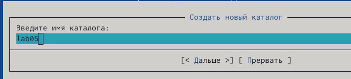
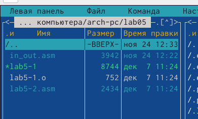

---
## Front matter
title: "Отчёт по лабораторной работе №5"
subtitle: "Архитектура вычислительных систем"
author: "Валиева Марина Русланбековна"

## Generic otions
lang: ru-RU
toc-title: "Содержание"

## Bibliography
bibliography: bib/cite.bib
csl: pandoc/csl/gost-r-7-0-5-2008-numeric.csl

## Pdf output format
toc: true # Table of contents
toc-depth: 2
lof: true # List of figures
lot: true # List of tables
fontsize: 12pt
linestretch: 1.5
papersize: a4
documentclass: scrreprt
## I18n polyglossia
polyglossia-lang:
  name: russian
  options:
	- spelling=modern
	- babelshorthands=true
polyglossia-otherlangs:
  name: english
## I18n babel
babel-lang: russian
babel-otherlangs: english
## Fonts
mainfont: PT Serif
romanfont: PT Serif
sansfont: PT Sans
monofont: PT Mono
mainfontoptions: Ligatures=TeX
romanfontoptions: Ligatures=TeX
sansfontoptions: Ligatures=TeX,Scale=MatchLowercase
monofontoptions: Scale=MatchLowercase,Scale=0.9
## Biblatex
biblatex: true
biblio-style: "gost-numeric"
biblatexoptions:
  - parentracker=true
  - backend=biber
  - hyperref=auto
  - language=auto
  - autolang=other*
  - citestyle=gost-numeric
## Pandoc-crossref LaTeX customization
figureTitle: "Рис."
tableTitle: "Таблица"
listingTitle: "Листинг"
lofTitle: "Список иллюстраций"
lotTitle: "Список таблиц"
lolTitle: "Листинги"
## Misc options
indent: true
header-includes:
  - \usepackage{indentfirst}
  - \usepackage{float} # keep figures where there are in the text
  - \floatplacement{figure}{H} # keep figures where there are in the text
---

# Цель работы

Приобретение практических навыков работы в Midnight Commander и освоение инструкций языка ассемблера mov и int.

# Выполнение лабораторной работы

1. Откроем Midnight Commander

{ #fig:001 width=90% }

2. Пользуясь клавишами ↑ , ↓ и Enter перейдите в каталог ~/work/arch-pc созданный при выполнении лабораторной работы No5.

{ #fig:002 width=90% }
{ #fig:003 width=90% }

3. С помощью функциональной клавиши F7 создадим папку lab05 и перейдем в созданный каталог.

{ #fig:004 width=90% }

4. Пользуясь строкой ввода и командой touch создадим файл lab5-1.asm.

{ #fig:005 width=90% }

5. С помощью функциональной клавиши F4 откройте файл lab6-1.asm для редактирования во встроенном редакторе. Как правило в качестве встроенного редактора Midnight Commander используется редакторы nano или mcedit

{ #fig:006 width=90% }

6. Введем текст программы из листинга 6.1 , сохраните изменения и закройте файл.

{ #fig:007 width=90% }

7. С помощью функциональной клавиши F3 откроем файл lab6-1.asm для просмотра. Убедимся, что файл содержит текст программы.

8. Оттранслируем текст программы lab5-1.asm в объектный файл. Выполним компоновку объектного файла и запустим получившийся исполняемый файл. Программа выводит строку 'Введите строку:' и ожидает ввода с клавиатуры. На запрос введем наши данные.

{ #fig:008 width=90% }

9. Скачаем файл in_out.asm со страницы курса в ТУИС.

10. Подключаемый файл in_out.asm должен лежать в том же каталоге, что и файл с программой, в которой он используется.

11. С помощью функциональной клавиши F6 создадим копию файла lab6-1.asm с именем lab6-2.asm. Выделим файл lab6-1.asm, нажмем клавишу F6 , введем имя файла lab6-2.asm и нажмем клавишу Enter.

{ #fig:009 width=90% }

12. Исправим текст программы в файле lab6-2.asm с использование подпрограмм из внешнего файла in_out.asm (используем подпрограммы sprintLF, sread и quit) в соответствии с листингом 6.2. Создадим исполняемый файл и проверим его работу.

{ #fig:010 width=90% }
{ #fig:011 width=90% }
{ #fig:0012 width=90% }

13. В файле lab6-2.asm заменим подпрограмму sprintLF на sprint. Создадим исполняемый файл и проверим его работу. 

{ #fig:0013 width=90% }

# Выполнение самостоятельной работы

1. Создадим копию файла lab6-1.asm. Внесем изменения в программу (без использования внешнего файла in_out.asm), так чтобы она работала по следующему алгоритму:
• вывести приглашение типа “Введите строку:”;
• ввести строку с клавиатуры;
• вывести введённую строку на экран.

2. Получим исполняемый файл и проверим его работу. На приглашение ввести строку введите свою фамилию.

3. Создадим копию файла lab6-2.asm. Исправим текст программы с использование подпрограмм из внешнего файла in_out.asm, так чтобы она работала по следующему алгоритму:
• вывести приглашение типа “Введите строку:”;
• ввести строку с клавиатуры;
• вывести введённую строку на экран.

4. Создадим исполняемый файл и проверьте его работу.

{ #fig:0014 width=90% }

# Выводы

В ходе лабораторной работы №5 мы приобрели практические навыки работы в Midnight Commander и освоили инструкций языка ассемблера mov и int.

